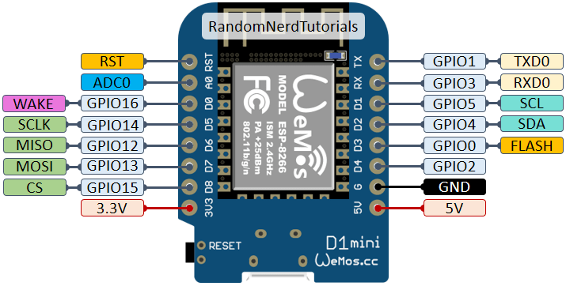
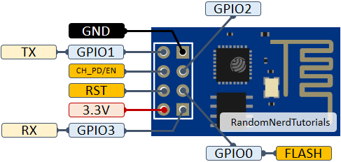

# ESP8266 - Open Garage
## Pin out
### ESP8266 - D1 Mini


### ESP8266 - ESP 01


## Get Certificate

1. Log in to Raspberry pi
2. Check Verion of OpenSSL with `pi@octopi:~$ openssl version`
3. Generating a certificate for SSL Server
a) Having No Certificate from the CA
b) Generate a server key `pi@octopi:~$ openssl genrsa -out server.key 2048`
c) Generate a signing request specifying 3650 days `pi@octopi:~ $ openssl req -new -key server.key -out server.csr -days 3650 -sha256`
d) Sign the request using the self signed CA `pi@octopi:~$ openssl x509 -req -in server.csr -CA CA.crt -CAkey CA.key -CAcreateserial -out server.crt -sha256`
e) Copy `server.csr` in  
```
static const char serverCert[] PROGMEM = R"EOF(
paste here content of "server.csr"
)EOF";
```
f) Copy `server.key` in  ``
```
static const char serverKey[] PROGMEM =  R"EOF(
paste here content of "server.key"
)EOF";
```


1. Download the latest version of the Certbot installer for Windows at https://dl.eff.org/certbot-beta-installer-win32.exe.
2. Run the installer and follow the wizard. The installer will propose a default installation directory, C:\Program Files(x86), that can be customized.)
3. To start a shell for Certbot, select the Start menu, enter cmd (to run CMD.EXE) or powershell (to run PowerShell), and click on “Run as administrator” in the contextual menu that shows up above.
4. Run Certbot as a shell command.
5.

